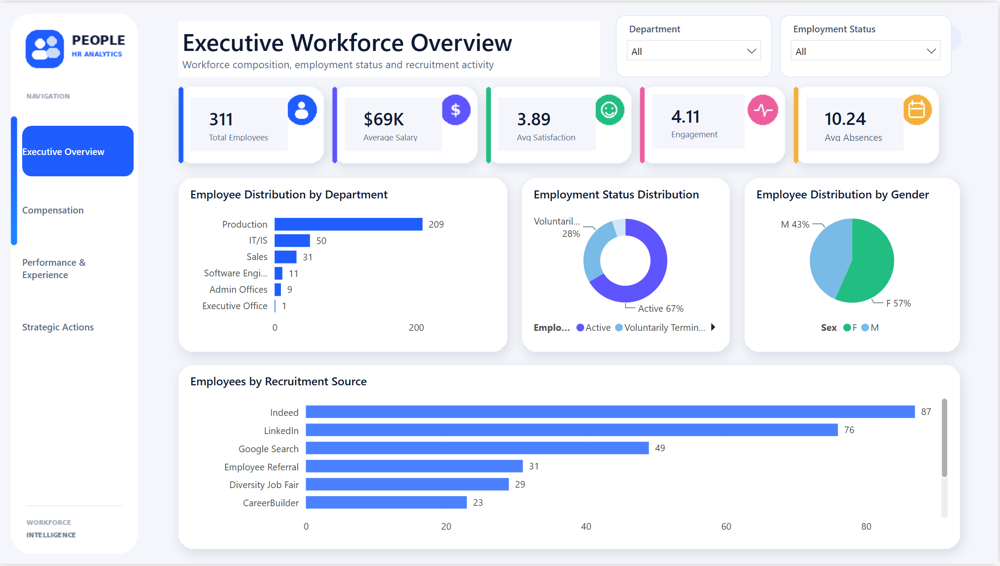
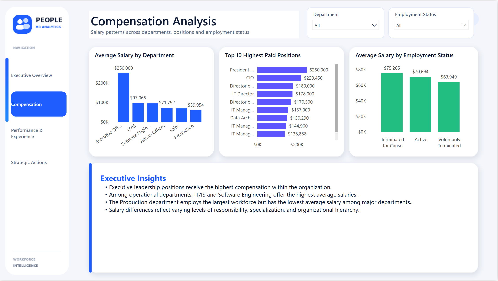
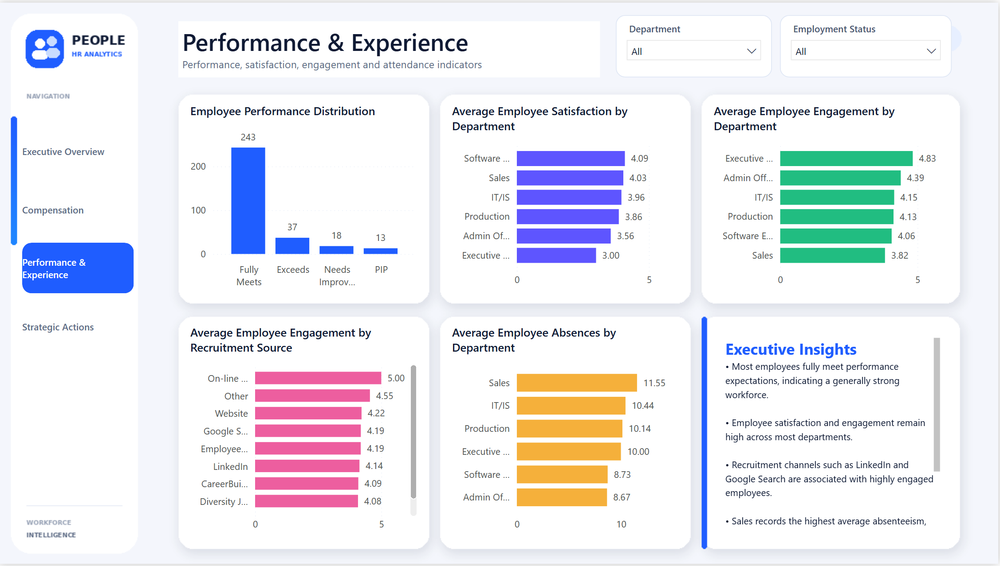
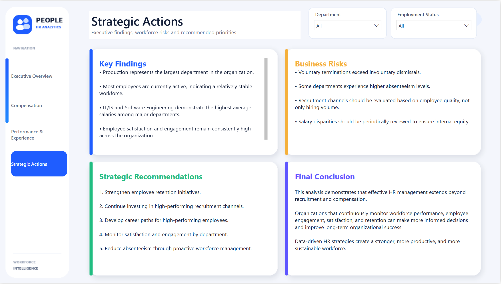

# HR Analytics: Workforce Performance & Employee Insights


---

## Project Overview

This project is an end-to-end HR Analytics case study focused on workforce performance, compensation, employee engagement, satisfaction, recruitment effectiveness, absenteeism, and retention.

The objective is to transform raw HR data into clear business insights using Python, SQL, and Power BI, then communicate those insights through an executive dashboard and strategic recommendations.

---

## Business Objectives

This project answers key HR business questions such as:

- How is the workforce distributed across departments?
- Which departments and positions have the highest salaries?
- What is the current employee status distribution?
- Which recruitment sources generate the most employees?
- Which recruitment sources are associated with higher engagement?
- Which departments report the highest satisfaction and engagement?
- Which departments experience the highest absenteeism?
- What strategic actions should HR leaders take?

---

## Dataset

The dataset contains employee-level HR information from a fictitious organization.

Main fields include:

- Employee ID
- Department
- Position
- Salary
- Employment Status
- Recruitment Source
- Performance Score
- Engagement Survey
- Employee Satisfaction
- Absences
- Manager
- Gender
- Race
- Date of Hire
- Date of Termination
- Termination Reason

---

## Tools Used

| Category | Tools |
|---|---|
| Programming | Python |
| Data Analysis | Pandas, NumPy |
| Visualization | Matplotlib, Power BI |
| Database | MySQL |
| Environment | Jupyter Notebook |
| Documentation | GitHub Markdown |

---

## Project Workflow

```text
Raw HR Dataset
      ↓
Data Understanding
      ↓
Data Quality Assessment
      ↓
Exploratory Data Analysis
      ↓
Feature Engineering
      ↓
Executive Summary & Recommendations
      ↓
SQL Business Analysis
      ↓
Power BI Dashboard
```

---

## Repository Structure

```text
hr-analytics-workforce-performance/
│
├── data/
│   └── HRDataset_v14.csv
│
├── notebooks/
│   ├── 01_data_understanding.ipynb
│   ├── 02_data_quality_assessment.ipynb
│   ├── 03_exploratory_data_analysis.ipynb
│   ├── 04_feature_engineering.ipynb
│   └── 05_executive_summary_and_business_recommendations.ipynb
│
├── sql/
│   └── hr_workforce_business_analysis.sql
│
├── dashboard/
│   └── HR_Analytics_Dashboard.pbix
│
├── images/
│   ├── executive_overview.png
│   ├── compensation_analysis.png
│   ├── performance_experience.png
│   └── executive_recommendations.png
│
├── README.md
├── requirements.txt
└── LICENSE
```

---

## Notebook Breakdown

### 01 - Data Understanding

This notebook introduces the dataset and reviews:

- Dataset dimensions
- Column names
- Data types
- Numerical summaries
- Categorical summaries
- Initial observations

---

### 02 - Data Quality Assessment

This notebook evaluates dataset reliability through:

- Missing values analysis
- Missing value percentages
- Duplicate record checks
- Data type review
- Unique value counts
- Data quality conclusion

Key finding: missing values in `DateofTermination` are expected because active employees do not have termination dates.

---

### 03 - Exploratory Data Analysis

This notebook answers HR business questions using Python.

Key areas analyzed:

- Workforce distribution by department
- Employment status distribution
- Salary by department
- Salary by position
- Recruitment source effectiveness
- Performance score distribution
- Employee satisfaction
- Employee engagement
- Absenteeism by department
- Descriptive salary and absence statistics

---

### 04 - Feature Engineering

New business-oriented features were created to support deeper analysis:

- Salary Category
- Satisfaction Category
- Engagement Category
- Attendance Category
- High Performer Flag
- Attrition Flag

These features make the dataset more useful for SQL analysis and Power BI dashboarding.

---

### 05 - Executive Summary & Business Recommendations

This notebook translates the analysis into decision-focused findings and recommendations for HR leaders.

It summarizes:

- Workforce structure
- Compensation insights
- Recruitment effectiveness
- Performance patterns
- Engagement and satisfaction levels
- Attendance risks
- Strategic HR recommendations

---

## SQL Business Analysis

The SQL file contains 20 executive business questions.

The analysis covers:

- Total employee count
- Employees by department
- Employment status distribution
- Gender and race distribution
- Average salary by department
- Top paid positions
- Salary statistics
- Performance score distribution
- Satisfaction by department
- Engagement by department
- High performers by department
- Recruitment source analysis
- Absenteeism by department
- Termination reason analysis
- Executive workforce summary

---

## Power BI Dashboard

The Power BI dashboard contains four executive pages:

### 1. Executive Overview

Provides a high-level summary of workforce KPIs including:

- Total Employees
- Average Salary
- Average Satisfaction
- Average Engagement
- Average Absences
- Employees by Department
- Employment Status Distribution
- Gender Distribution
- Recruitment Source Distribution

### 2. Compensation Analysis

Analyzes salary patterns across the organization, including:

- Average Salary by Department
- Top 10 Highest Paid Positions
- Average Salary by Employment Status
- Executive compensation insights

### 3. Performance & Experience

Focuses on employee performance and workforce experience, including:

- Performance Score Distribution
- Satisfaction by Department
- Engagement by Department
- Engagement by Recruitment Source
- Absenteeism by Department
- Executive insights

### 4. Executive Recommendations

Summarizes the main findings, business risks, strategic recommendations, and final conclusion.

---

## Dashboard Preview

### Executive Overview



---

### Compensation Analysis



---

### Performance & Experience



---

### Executive Recommendations



---

## Key Insights

- Production represents the largest department in the organization.
- Most employees are currently active.
- IT/IS and Software Engineering have the highest average salaries among major departments.
- Executive leadership positions receive the highest compensation overall.
- Indeed and LinkedIn generate the largest number of hires.
- LinkedIn, Google Search, and Employee Referral are associated with strong employee engagement.
- Employee satisfaction and engagement are generally high across the organization.
- Sales records the highest average absenteeism.
- Voluntary terminations exceed involuntary dismissals.

---

## Strategic Recommendations

1. Strengthen employee retention initiatives to reduce voluntary turnover.
2. Continue investing in recruitment channels associated with highly engaged employees.
3. Develop career growth paths for high-performing employees.
4. Monitor satisfaction and engagement at the department level.
5. Review absenteeism trends and implement proactive workforce management initiatives.
6. Periodically evaluate salary distribution to support internal compensation equity.

---

## Skills Demonstrated

- Data Cleaning
- Data Quality Assessment
- Exploratory Data Analysis
- Feature Engineering
- Descriptive Statistics
- SQL Business Analysis
- Power BI Dashboard Design
- KPI Development
- HR Analytics
- Executive Storytelling
- Business Recommendations

---

## Future Improvements

- Add employee attrition prediction using machine learning.
- Build an interactive web-based HR dashboard.
- Add statistical testing for salary equity analysis.
- Include time-based workforce trend analysis.
- Add advanced segmentation by tenure, department, and performance.

---

## Author

**Saad Maher**

Aspiring Data Analyst focused on Python, SQL, Power BI, and business analytics.

If you found this project useful, consider starring the repository.
